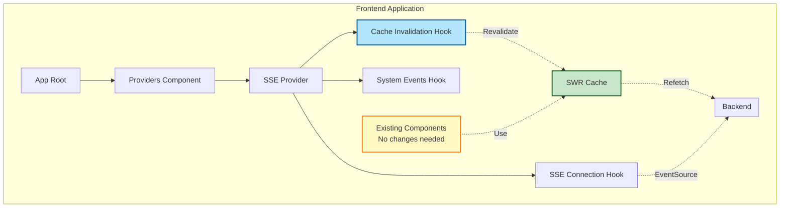
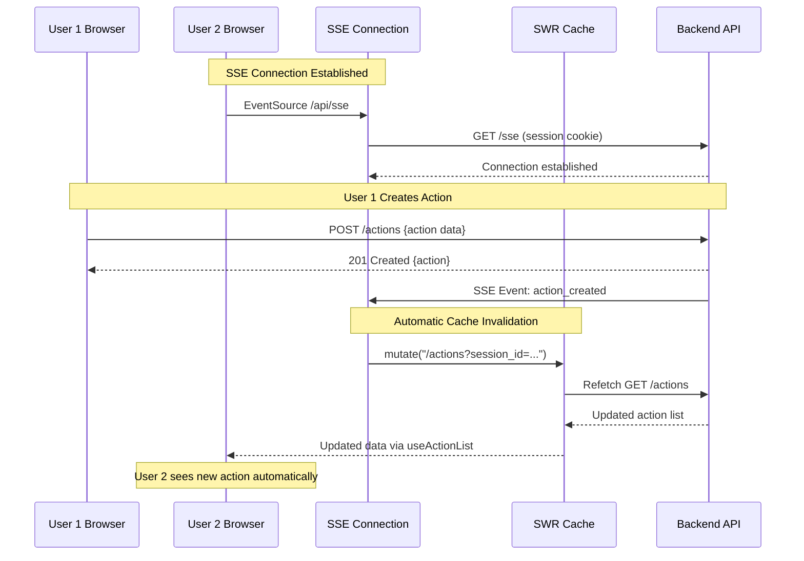

# SSE Communication - Frontend Implementation Plan

## Overview

This document outlines the frontend implementation for Server-Sent Events (SSE) infrastructure to enable real-time, unidirectional communication from backend to frontend. The implementation leverages existing codebase patterns (SWR, Zustand, custom hooks) to provide automatic cache invalidation when SSE events are received.

**Design Philosophy: THE SIMPLEST SOLUTION**

Instead of manually updating component state when SSE events arrive, we **revalidate SWR caches** and let SWR refetch the data automatically. This approach:
- Requires zero changes to existing components
- Leverages existing infrastructure (SWR, EntityApi)
- Maintains consistency with REST API patterns
- Provides automatic optimistic updates
- Follows established codebase conventions

---

## Architecture Overview



### Event Flow Sequence



---

## Core Design Decisions

### 1. SWR Cache Invalidation (Not Manual State Updates)

**Why:** Existing components use SWR hooks (`useActionList`, `useAction`, etc.). Rather than manually updating state, we invalidate the SWR cache when SSE events arrive. SWR automatically refetches the data.

**Benefits:**
- Zero component changes required
- Consistent with existing patterns
- Automatic deduplication and request batching
- Built-in error handling and retry logic
- Works with existing optimistic updates

### 2. Strong Typing Throughout (No `any` Types)

**Why:** TypeScript provides compile-time safety and IntelliSense support.

**Implementation:**
- Event types match backend exactly (`src/types/sse-events.ts`)
- Type guards for runtime validation
- Generic type parameters for event handlers
- Strict null checks

### 3. Automatic Reconnection with Exponential Backoff

**Why:** Network failures are inevitable in production.

**Implementation:**
- Exponential backoff (1s → 1.5s → 2.25s → ... → 30s max)
- Max 10 reconnection attempts
- Connection state tracked in Zustand store
- Visible in DevTools for debugging

### 4. Connection State Management via Zustand

**Why:** Follows existing pattern (auth-store, organization-state-store).

**Implementation:**
- `SseConnectionStore` tracks connection state
- States: Disconnected, Connecting, Connected, Reconnecting, Error
- Error tracking with timestamps and attempt numbers
- DevTools integration

### 5. Provider Composition Pattern

**Why:** Consistent with existing provider architecture.

**Implementation:**
- `SseConnectionStoreProvider` - Provides connection state
- `SseProvider` - Composes hooks and provides to app
- Added to root `Providers` component

---

## File Structure

```
src/
├── types/
│   └── sse-events.ts                         # Event type definitions
│
├── lib/
│   ├── stores/
│   │   └── sse-connection-store.ts           # Connection state management
│   │
│   ├── hooks/
│   │   ├── use-sse-connection.ts             # SSE connection with reconnection
│   │   ├── use-sse-event-handler.ts          # Type-safe event handler
│   │   ├── use-sse-cache-invalidation.ts     # SWR cache invalidation
│   │   └── use-sse-system-events.ts          # System events (force logout)
│   │
│   └── providers/
│       ├── sse-connection-store-provider.tsx  # Connection store provider
│       └── sse-provider.tsx                   # Main SSE provider
│
└── components/
    ├── providers.tsx                          # Root providers (updated)
    └── sse-connection-indicator.tsx           # Optional: UI indicator
```

---

## Implementation Phases

### Phase 1: Type Definitions

**File:** `src/types/sse-events.ts`

Create strongly-typed event definitions matching backend exactly.

```typescript
import { Id } from './general';
import { Action } from './action';
import { Agreement } from './agreement';
import { OverarchingGoal } from './overarching-goal';

/**
 * SSE event types - must match backend exactly
 */
export type SseEventType =
  | 'action_created'
  | 'action_updated'
  | 'action_deleted'
  | 'agreement_created'
  | 'agreement_updated'
  | 'agreement_deleted'
  | 'goal_created'
  | 'goal_updated'
  | 'goal_deleted'
  | 'force_logout';

/**
 * SSE event payload wrapper - matches backend serialization
 * Backend sends: { type: "action_created", data: { coaching_session_id, action } }
 */
export interface SseEventEnvelope<T> {
  type: SseEventType;
  data: T;
}

// Session-scoped events
export interface ActionCreatedData {
  coaching_session_id: Id;
  action: Action;
}

export interface ActionUpdatedData {
  coaching_session_id: Id;
  action: Action;
}

export interface ActionDeletedData {
  coaching_session_id: Id;
  action_id: Id;
}

// Relationship-scoped events
export interface AgreementCreatedData {
  coaching_relationship_id: Id;
  agreement: Agreement;
}

export interface AgreementUpdatedData {
  coaching_relationship_id: Id;
  agreement: Agreement;
}

export interface AgreementDeletedData {
  coaching_relationship_id: Id;
  agreement_id: Id;
}

export interface GoalCreatedData {
  coaching_relationship_id: Id;
  goal: OverarchingGoal;
}

export interface GoalUpdatedData {
  coaching_relationship_id: Id;
  goal: OverarchingGoal;
}

export interface GoalDeletedData {
  coaching_relationship_id: Id;
  goal_id: Id;
}

// System events
export interface ForceLogoutData {
  reason: string;
}

// Union type for all event data
export type SseEventData =
  | ActionCreatedData
  | ActionUpdatedData
  | ActionDeletedData
  | AgreementCreatedData
  | AgreementUpdatedData
  | AgreementDeletedData
  | GoalCreatedData
  | GoalUpdatedData
  | GoalDeletedData
  | ForceLogoutData;

/**
 * Type guards for runtime validation
 */
export function isActionCreatedData(data: unknown): data is ActionCreatedData {
  if (!data || typeof data !== 'object') return false;
  const obj = data as Record<string, unknown>;
  return (
    typeof obj.coaching_session_id === 'string' &&
    typeof obj.action === 'object' &&
    obj.action !== null
  );
}

export function isActionUpdatedData(data: unknown): data is ActionUpdatedData {
  return isActionCreatedData(data);
}

export function isActionDeletedData(data: unknown): data is ActionDeletedData {
  if (!data || typeof data !== 'object') return false;
  const obj = data as Record<string, unknown>;
  return (
    typeof obj.coaching_session_id === 'string' &&
    typeof obj.action_id === 'string'
  );
}

export function isForceLogoutData(data: unknown): data is ForceLogoutData {
  if (!data || typeof data !== 'object') return false;
  const obj = data as Record<string, unknown>;
  return typeof obj.reason === 'string';
}

// TODO: Add type guards for agreements, goals, etc.
```

**Why:**
- Compile-time type safety
- IntelliSense support in event handlers
- Runtime validation via type guards
- Single source of truth for event structure

---

### Phase 2: Connection State Store

**File:** `src/lib/stores/sse-connection-store.ts`

Create Zustand store for connection state management.

```typescript
import { create } from 'zustand';
import { devtools } from 'zustand/middleware';

export enum SseConnectionState {
  Disconnected = "Disconnected",
  Connecting = "Connecting",
  Connected = "Connected",
  Reconnecting = "Reconnecting",
  Error = "Error",
}

interface SseError {
  message: string;
  timestamp: Date;
  attemptNumber: number;
}

interface SseConnectionStateData {
  state: SseConnectionState;
  lastError: SseError | null;
  reconnectAttempts: number;
  lastConnectedAt: Date | null;
  lastEventAt: Date | null;
}

interface SseConnectionActions {
  setConnecting: () => void;
  setConnected: () => void;
  setReconnecting: (attempt: number) => void;
  setError: (error: string) => void;
  setDisconnected: () => void;
  recordEvent: () => void;
  resetReconnectAttempts: () => void;
}

export type SseConnectionStore = SseConnectionStateData & SseConnectionActions;

const defaultState: SseConnectionStateData = {
  state: SseConnectionState.Disconnected,
  lastError: null,
  reconnectAttempts: 0,
  lastConnectedAt: null,
  lastEventAt: null,
};

export const createSseConnectionStore = () => {
  return create<SseConnectionStore>()(
    devtools(
      (set) => ({
        ...defaultState,

        setConnecting: () => {
          set({ state: SseConnectionState.Connecting });
        },

        setConnected: () => {
          set({
            state: SseConnectionState.Connected,
            lastConnectedAt: new Date(),
            reconnectAttempts: 0,
            lastError: null,
          });
        },

        setReconnecting: (attempt: number) => {
          set({
            state: SseConnectionState.Reconnecting,
            reconnectAttempts: attempt,
          });
        },

        setError: (message: string) => {
          set((state) => ({
            state: SseConnectionState.Error,
            lastError: {
              message,
              timestamp: new Date(),
              attemptNumber: state.reconnectAttempts,
            },
          }));
        },

        setDisconnected: () => {
          set(defaultState);
        },

        recordEvent: () => {
          set({ lastEventAt: new Date() });
        },

        resetReconnectAttempts: () => {
          set({ reconnectAttempts: 0 });
        },
      }),
      { name: 'sse-connection-store' }
    )
  );
};
```

**Why:**
- Follows existing Zustand store pattern
- DevTools integration for debugging
- Tracks connection health and errors
- Visible in Redux DevTools

---

### Phase 3: SSE Connection Hook

**File:** `src/lib/hooks/use-sse-connection.ts`

Core hook that establishes SSE connection with automatic reconnection.

```typescript
"use client";

import { useEffect, useRef, useCallback } from 'react';
import { siteConfig } from '@/site.config';
import { useSseConnectionStore } from '@/lib/providers/sse-connection-store-provider';
import { SseConnectionState } from '@/lib/stores/sse-connection-store';

interface ReconnectionConfig {
  maxAttempts: number;
  initialDelay: number;
  maxDelay: number;
  backoffMultiplier: number;
}

const DEFAULT_RECONNECTION_CONFIG: ReconnectionConfig = {
  maxAttempts: 10,
  initialDelay: 1000,      // 1 second
  maxDelay: 30000,         // 30 seconds
  backoffMultiplier: 1.5,
};

/**
 * Core SSE connection hook with automatic reconnection and exponential backoff.
 *
 * Features:
 * - Auth-gated connection (only connects when user is authenticated)
 * - Automatic reconnection with exponential backoff
 * - Connection state management via Zustand store
 * - Graceful cleanup on unmount and logout
 * - Event listener management
 *
 * @param isLoggedIn - Whether the user is authenticated (gates connection establishment)
 * @returns EventSource instance or null if not connected
 */
export function useSseConnection(isLoggedIn: boolean) {
  const eventSourceRef = useRef<EventSource | null>(null);
  const reconnectTimeoutRef = useRef<NodeJS.Timeout | null>(null);
  const reconnectAttemptsRef = useRef(0);
  const mountedRef = useRef(true);

  const {
    setConnecting,
    setConnected,
    setReconnecting,
    setError,
    setDisconnected,
    resetReconnectAttempts,
  } = useSseConnectionStore((store) => ({
    setConnecting: store.setConnecting,
    setConnected: store.setConnected,
    setReconnecting: store.setReconnecting,
    setError: store.setError,
    setDisconnected: store.setDisconnected,
    resetReconnectAttempts: store.resetReconnectAttempts,
  }));

  const calculateBackoff = useCallback((attempt: number): number => {
    const delay = Math.min(
      DEFAULT_RECONNECTION_CONFIG.initialDelay *
        Math.pow(DEFAULT_RECONNECTION_CONFIG.backoffMultiplier, attempt),
      DEFAULT_RECONNECTION_CONFIG.maxDelay
    );
    return delay;
  }, []);

  const cleanup = useCallback(() => {
    if (eventSourceRef.current) {
      eventSourceRef.current.close();
      eventSourceRef.current = null;
    }
    if (reconnectTimeoutRef.current) {
      clearTimeout(reconnectTimeoutRef.current);
      reconnectTimeoutRef.current = null;
    }
  }, []);

  const connect = useCallback(() => {
    if (!mountedRef.current || !isLoggedIn) return;

    // Close existing connection
    cleanup();

    setConnecting();

    try {
      const es = new EventSource(
        `${siteConfig.env.backendServiceURL}/sse`,
        { withCredentials: true }
      );

      es.onopen = () => {
        if (!mountedRef.current) {
          es.close();
          return;
        }
        console.log('[SSE] Connection established');
        setConnected();
        resetReconnectAttempts();
        reconnectAttemptsRef.current = 0;
      };

      es.onerror = (error) => {
        if (!mountedRef.current) return;

        console.error('[SSE] Connection error:', error);

        // EventSource automatically attempts to reconnect on error
        // We handle the error state and implement our own backoff
        reconnectAttemptsRef.current += 1;
        const currentAttempts = reconnectAttemptsRef.current;

        if (currentAttempts >= DEFAULT_RECONNECTION_CONFIG.maxAttempts) {
          setError(`Max reconnection attempts (${DEFAULT_RECONNECTION_CONFIG.maxAttempts}) reached`);
          cleanup();
        } else {
          setError(`Connection error (attempt ${currentAttempts})`);
          setReconnecting(currentAttempts);

          const delay = calculateBackoff(currentAttempts);
          console.log(`[SSE] Reconnecting in ${delay}ms...`);

          reconnectTimeoutRef.current = setTimeout(() => {
            if (mountedRef.current && isLoggedIn) {
              connect();
            }
          }, delay);
        }
      };

      eventSourceRef.current = es;
    } catch (error) {
      console.error('[SSE] Failed to create EventSource:', error);
      setError(error instanceof Error ? error.message : 'Unknown error');
    }
  }, [
    cleanup,
    setConnecting,
    setConnected,
    setError,
    setReconnecting,
    resetReconnectAttempts,
    calculateBackoff,
    isLoggedIn,
  ]);

  // Establish connection when logged in, disconnect when logged out
  useEffect(() => {
    mountedRef.current = true;

    if (isLoggedIn) {
      connect();
    } else {
      cleanup();
      setDisconnected();
    }

    // Cleanup on unmount
    return () => {
      mountedRef.current = false;
      cleanup();
      setDisconnected();
    };
  }, [isLoggedIn, connect, cleanup, setDisconnected]);

  return eventSourceRef.current;
}
```

**Why:**
- Auth-gated connection ensures SSE only connects for authenticated users
- Uses ref for reconnectAttempts to avoid triggering useCallback re-creation
- Automatic reconnection prevents permanent disconnection
- Exponential backoff prevents server overload
- Cleanup prevents memory leaks
- Connection state visible in DevTools
- Responds to logout by immediately closing connection

---

### Phase 4: Event Handler Hook

**File:** `src/lib/hooks/use-sse-event-handler.ts`

Type-safe hook for handling SSE events.

```typescript
"use client";

import { useEffect, useRef } from 'react';
import type { SseEventType, SseEventData } from '@/types/sse-events';
import { useSseConnectionStore } from '@/lib/providers/sse-connection-store-provider';
import { transformEntityDates } from '@/types/general';

/**
 * Type-safe SSE event handler hook.
 *
 * Features:
 * - Strong typing (no `any` types)
 * - Automatic event listener cleanup
 * - Date transformation for consistency with REST API
 * - Connection state tracking
 * - Runtime type validation (optional)
 *
 * @template T - The expected event data type
 * @param eventSource - The EventSource instance
 * @param eventType - The SSE event type to listen for
 * @param handler - Callback function to handle the event
 * @param typeGuard - Optional runtime type guard for validation
 */
export function useSseEventHandler<T extends SseEventData>(
  eventSource: EventSource | null,
  eventType: SseEventType,
  handler: (data: T) => void,
  typeGuard?: (data: unknown) => data is T
) {
  // Use ref to avoid recreating listener on every render
  const handlerRef = useRef(handler);
  const recordEvent = useSseConnectionStore((store) => store.recordEvent);

  // Update ref when handler changes
  useEffect(() => {
    handlerRef.current = handler;
  }, [handler]);

  useEffect(() => {
    if (!eventSource) return;

    const listener = (e: MessageEvent) => {
      try {
        // Parse event data
        const parsed = JSON.parse(e.data);

        // Transform dates (consistent with REST API)
        const transformed = transformEntityDates(parsed);

        // Optional runtime validation
        if (typeGuard && !typeGuard(transformed.data)) {
          console.error(
            `[SSE] Type guard failed for event ${eventType}:`,
            transformed.data
          );
          return;
        }

        // Record event for connection health tracking
        recordEvent();

        // Invoke handler with typed data
        handlerRef.current(transformed.data as T);
      } catch (error) {
        console.error(`[SSE] Failed to parse ${eventType} event:`, error, e.data);
      }
    };

    eventSource.addEventListener(eventType, listener);

    return () => {
      eventSource.removeEventListener(eventType, listener);
    };
  }, [eventSource, eventType, typeGuard, recordEvent]);
}
```

**Why:**
- Type-safe (no `any` types)
- Date transformation for consistency
- Automatic cleanup prevents memory leaks
- Optional type guards for runtime validation

---

### Phase 5: SWR Cache Invalidation Hook (THE KEY IMPROVEMENT)

**File:** `src/lib/hooks/use-sse-cache-invalidation.ts`

This is the core architectural improvement over manual state updates.

```typescript
"use client";

import { useCallback } from 'react';
import { useSWRConfig } from 'swr';
import { siteConfig } from '@/site.config';
import { useSseEventHandler } from './use-sse-event-handler';
import type {
  ActionCreatedData,
  ActionUpdatedData,
  ActionDeletedData,
  AgreementCreatedData,
  AgreementUpdatedData,
  AgreementDeletedData,
  GoalCreatedData,
  GoalUpdatedData,
  GoalDeletedData,
} from '@/types/sse-events';

/**
 * SSE cache invalidation hook that automatically revalidates SWR caches
 * when SSE events are received.
 *
 * THIS IS THE SIMPLEST SOLUTION:
 * - Rather than manually updating component state, we invalidate SWR caches
 * - SWR automatically refetches the data
 * - Existing components using useActionList, useAction, etc. require NO changes
 * - Consistent with existing REST API patterns
 * - Automatic deduplication and batching
 *
 * @param eventSource - The SSE connection
 */
export function useSseCacheInvalidation(eventSource: EventSource | null) {
  const { mutate } = useSWRConfig();
  const baseUrl = siteConfig.env.backendServiceURL;

  // ==================== ACTION EVENTS ====================

  useSseEventHandler<ActionCreatedData>(
    eventSource,
    'action_created',
    (data) => {
      // Invalidate all action caches
      mutate((key) => typeof key === 'string' && key.includes(`${baseUrl}/actions`));

      console.log('[SSE] Revalidated actions for session:', data.coaching_session_id);
    }
  );

  useSseEventHandler<ActionUpdatedData>(
    eventSource,
    'action_updated',
    (data) => {
      // Invalidate all action caches
      mutate((key) => typeof key === 'string' && key.includes(`${baseUrl}/actions`));

      console.log('[SSE] Revalidated action:', data.action.id);
    }
  );

  useSseEventHandler<ActionDeletedData>(
    eventSource,
    'action_deleted',
    (data) => {
      // Invalidate all action caches
      mutate((key) => typeof key === 'string' && key.includes(`${baseUrl}/actions`));

      console.log('[SSE] Revalidated actions after deletion:', data.action_id);
    }
  );

  // ==================== AGREEMENT EVENTS ====================

  useSseEventHandler<AgreementCreatedData>(
    eventSource,
    'agreement_created',
    (data) => {
      // Invalidate all agreement caches
      mutate((key) => typeof key === 'string' && key.includes(`${baseUrl}/agreements`));

      console.log('[SSE] Revalidated agreements for relationship:', data.coaching_relationship_id);
    }
  );

  useSseEventHandler<AgreementUpdatedData>(
    eventSource,
    'agreement_updated',
    (data) => {
      // Invalidate all agreement caches
      mutate((key) => typeof key === 'string' && key.includes(`${baseUrl}/agreements`));

      console.log('[SSE] Revalidated agreement:', data.agreement.id);
    }
  );

  useSseEventHandler<AgreementDeletedData>(
    eventSource,
    'agreement_deleted',
    (data) => {
      // Invalidate all agreement caches
      mutate((key) => typeof key === 'string' && key.includes(`${baseUrl}/agreements`));

      console.log('[SSE] Revalidated agreements after deletion:', data.agreement_id);
    }
  );

  // ==================== GOAL EVENTS ====================

  useSseEventHandler<GoalCreatedData>(
    eventSource,
    'goal_created',
    (data) => {
      // Invalidate all goal caches
      mutate((key) => typeof key === 'string' && key.includes(`${baseUrl}/overarching_goals`));

      console.log('[SSE] Revalidated goals for relationship:', data.coaching_relationship_id);
    }
  );

  useSseEventHandler<GoalUpdatedData>(
    eventSource,
    'goal_updated',
    (data) => {
      // Invalidate all goal caches
      mutate((key) => typeof key === 'string' && key.includes(`${baseUrl}/overarching_goals`));

      console.log('[SSE] Revalidated goal:', data.goal.id);
    }
  );

  useSseEventHandler<GoalDeletedData>(
    eventSource,
    'goal_deleted',
    (data) => {
      // Invalidate all goal caches
      mutate((key) => typeof key === 'string' && key.includes(`${baseUrl}/overarching_goals`));

      console.log('[SSE] Revalidated goals after deletion:', data.goal_id);
    }
  );
}
```

**Why:**
- **Simplest solution** - leverages existing SWR infrastructure
- **Zero component changes** - components using `useActionList` automatically get updated data
- **Consistent patterns** - matches `EntityApi.useEntityMutation` cache invalidation pattern
- **Broad invalidation** - simple `includes()` check invalidates all related caches safely
- **Automatic deduplication** - SWR handles multiple simultaneous revalidations
- **Built-in error handling** - SWR retry logic applies

---

### Phase 6: System Events Hook

**File:** `src/lib/hooks/use-sse-system-events.ts`

Handle system-level events (force logout) using existing auth infrastructure.

```typescript
"use client";

import { useRouter } from 'next/navigation';
import { useAuthStore } from '@/lib/providers/auth-store-provider';
import { useLogoutUser } from '@/lib/hooks/use-logout-user';
import { useSseEventHandler } from './use-sse-event-handler';
import type { ForceLogoutData } from '@/types/sse-events';

/**
 * Handle system-level SSE events (force logout, etc.)
 * Integrates with existing auth infrastructure rather than direct manipulation.
 *
 * @param eventSource - The SSE connection
 */
export function useSseSystemEvents(eventSource: EventSource | null) {
  const router = useRouter();
  const logout = useLogoutUser();
  const isLoggedIn = useAuthStore((store) => store.isLoggedIn);

  useSseEventHandler<ForceLogoutData>(
    eventSource,
    'force_logout',
    async (data) => {
      console.warn('[SSE] Force logout received:', data.reason);

      if (isLoggedIn) {
        // Use existing logout infrastructure (cleans up stores, calls API, etc.)
        await logout();

        // Redirect with reason
        router.push(`/login?reason=forced_logout&message=${encodeURIComponent(data.reason)}`);
      }
    }
  );
}
```

**Why:**
- Uses existing `useLogoutUser` hook (proper cleanup)
- Integrates with auth store
- Consistent with existing logout flow
- Proper navigation (not `window.location.href`)

---

### Phase 7: SSE Providers

**File:** `src/lib/providers/sse-connection-store-provider.tsx`

Provider for SSE connection store (follows existing pattern).

```typescript
"use client";

import {
  type ReactNode,
  createContext,
  useRef,
  useContext,
} from 'react';
import { type StoreApi, useStore } from 'zustand';
import { type SseConnectionStore, createSseConnectionStore } from '@/lib/stores/sse-connection-store';
import { useShallow } from 'zustand/shallow';

export const SseConnectionStoreContext = createContext<StoreApi<SseConnectionStore> | null>(null);

export interface SseConnectionStoreProviderProps {
  children: ReactNode;
}

export const SseConnectionStoreProvider = ({ children }: SseConnectionStoreProviderProps) => {
  const storeRef = useRef<StoreApi<SseConnectionStore>>();

  if (!storeRef.current) {
    storeRef.current = createSseConnectionStore();
  }

  return (
    <SseConnectionStoreContext.Provider value={storeRef.current}>
      {children}
    </SseConnectionStoreContext.Provider>
  );
};

export const useSseConnectionStore = <T,>(
  selector: (store: SseConnectionStore) => T
): T => {
  const context = useContext(SseConnectionStoreContext);

  if (!context) {
    throw new Error('useSseConnectionStore must be used within SseConnectionStoreProvider');
  }

  return useStore(context, useShallow(selector));
};
```

**File:** `src/lib/providers/sse-provider.tsx`

Main SSE provider that composes all hooks.

```typescript
"use client";

import { type ReactNode } from 'react';
import { SseConnectionStoreProvider } from './sse-connection-store-provider';
import { useAuthStore } from '@/lib/providers/auth-store-provider';
import { useSseConnection } from '@/lib/hooks/use-sse-connection';
import { useSseCacheInvalidation } from '@/lib/hooks/use-sse-cache-invalidation';
import { useSseSystemEvents } from '@/lib/hooks/use-sse-system-events';

interface SseClientProps {
  children: ReactNode;
}

/**
 * Internal component that establishes SSE connection and sets up event handlers.
 * Must be rendered inside SseConnectionStoreProvider and AuthStoreProvider.
 */
function SseClient({ children }: SseClientProps) {
  const isLoggedIn = useAuthStore((store) => store.isLoggedIn);
  const eventSource = useSseConnection(isLoggedIn);

  // Auto-invalidate SWR caches on events
  useSseCacheInvalidation(eventSource);

  // Handle system events (force logout)
  useSseSystemEvents(eventSource);

  return <>{children}</>;
}

/**
 * Main SSE provider that wraps the application.
 * Establishes single app-wide SSE connection and handles all events.
 *
 * Usage:
 * ```tsx
 * <SseProvider>
 *   <YourApp />
 * </SseProvider>
 * ```
 */
export function SseProvider({ children }: SseClientProps) {
  return (
    <SseConnectionStoreProvider>
      <SseClient>{children}</SseClient>
    </SseConnectionStoreProvider>
  );
}
```

**Why:**
- Follows existing provider pattern (AuthStoreProvider, OrganizationStateStoreProvider)
- Clean separation of concerns
- Composes hooks cleanly
- Single app-wide connection

---

### Phase 8: Integrate into Root Providers

**File:** `src/components/providers.tsx` (updated)

Add SSE provider to existing provider composition.

```typescript
"use client";

import { ReactNode } from 'react';
import { AuthStoreProvider } from '@/lib/providers/auth-store-provider';
import { OrganizationStateStoreProvider } from '@/lib/providers/organization-state-store-provider';
import { CoachingRelationshipStateStoreProvider } from '@/lib/providers/coaching-relationship-state-store-provider';
import { SessionCleanupProvider } from '@/lib/providers/session-cleanup-provider';
import { SseProvider } from '@/lib/providers/sse-provider'; // NEW
import { SWRConfig } from 'swr';

interface ProvidersProps {
  children: ReactNode;
}

export function Providers({ children }: ProvidersProps) {
  return (
    <AuthStoreProvider>
      <OrganizationStateStoreProvider>
        <CoachingRelationshipStateStoreProvider>
          <SessionCleanupProvider>
            <SWRConfig
              value={{
                revalidateIfStale: true,
                focusThrottleInterval: 10000,
                provider: () => new Map(),
              }}
            >
              {/* NEW: SSE Provider establishes connection and handles events */}
              <SseProvider>
                {children}
              </SseProvider>
            </SWRConfig>
          </SessionCleanupProvider>
        </CoachingRelationshipStateStoreProvider>
      </OrganizationStateStoreProvider>
    </AuthStoreProvider>
  );
}
```

**Why:**
- Consistent with existing pattern
- SSE connection established once for entire app
- Events handled automatically
- Zero changes needed in existing components

---

### Phase 9 (Optional): Connection Status UI

**File:** `src/components/sse-connection-indicator.tsx`

Optional visual indicator for connection status.

```typescript
"use client";

import { useSseConnectionStore } from '@/lib/providers/sse-connection-store-provider';
import { SseConnectionState } from '@/lib/stores/sse-connection-store';
import { AlertCircle, Loader2, WifiOff } from 'lucide-react';

/**
 * Optional UI component to display SSE connection status.
 * Non-intrusive - only shows when NOT connected.
 *
 * Can be placed in app header/status bar:
 * ```tsx
 * <Header>
 *   <SseConnectionIndicator />
 * </Header>
 * ```
 */
export function SseConnectionIndicator() {
  const { state, lastError, reconnectAttempts } = useSseConnectionStore((store) => ({
    state: store.state,
    lastError: store.lastError,
    reconnectAttempts: store.reconnectAttempts,
  }));

  // Don't show anything when connected (non-intrusive)
  if (state === SseConnectionState.Connected) {
    return null;
  }

  const getIcon = () => {
    switch (state) {
      case SseConnectionState.Connecting:
      case SseConnectionState.Reconnecting:
        return <Loader2 className="h-4 w-4 animate-spin" />;
      case SseConnectionState.Error:
        return <AlertCircle className="h-4 w-4" />;
      case SseConnectionState.Disconnected:
        return <WifiOff className="h-4 w-4" />;
      default:
        return null;
    }
  };

  const getMessage = () => {
    switch (state) {
      case SseConnectionState.Connecting:
        return 'Connecting to live updates...';
      case SseConnectionState.Reconnecting:
        return `Reconnecting (attempt ${reconnectAttempts})...`;
      case SseConnectionState.Error:
        return lastError?.message || 'Connection error';
      case SseConnectionState.Disconnected:
        return 'Disconnected from live updates';
      default:
        return '';
    }
  };

  const getColorClass = () => {
    switch (state) {
      case SseConnectionState.Connecting:
      case SseConnectionState.Reconnecting:
        return 'text-yellow-600 dark:text-yellow-400';
      case SseConnectionState.Error:
        return 'text-red-600 dark:text-red-400';
      case SseConnectionState.Disconnected:
        return 'text-gray-600 dark:text-gray-400';
      default:
        return '';
    }
  };

  return (
    <div className={`flex items-center gap-2 text-sm ${getColorClass()}`}>
      {getIcon()}
      <span>{getMessage()}</span>
    </div>
  );
}
```

**Usage:**
```tsx
// In app header or status bar
import { SseConnectionIndicator } from '@/components/sse-connection-indicator';

export function AppHeader() {
  return (
    <header>
      <SseConnectionIndicator />
      {/* other header content */}
    </header>
  );
}
```

**Why:**
- Non-intrusive (hidden when connected)
- Visual feedback for users
- Useful for debugging
- Optional (not required for functionality)

---

## Testing Strategy

### Unit Tests

**Test SSE Event Handler:**
```typescript
// src/lib/hooks/__tests__/use-sse-event-handler.test.ts
import { renderHook } from '@testing-library/react';
import { useSseEventHandler } from '../use-sse-event-handler';
import type { ActionCreatedData } from '@/types/sse-events';

describe('useSseEventHandler', () => {
  it('should handle action_created events with correct typing', () => {
    const mockEventSource = new EventSource('mock-url');
    const mockHandler = jest.fn();

    renderHook(() =>
      useSseEventHandler<ActionCreatedData>(
        mockEventSource,
        'action_created',
        mockHandler
      )
    );

    // Trigger event
    const event = new MessageEvent('action_created', {
      data: JSON.stringify({
        type: 'action_created',
        data: {
          coaching_session_id: 'session-123',
          action: { id: 'action-1', /* ... */ }
        }
      })
    });

    mockEventSource.dispatchEvent(event);

    // Verify handler called with typed data
    expect(mockHandler).toHaveBeenCalledWith(
      expect.objectContaining({
        coaching_session_id: 'session-123',
        action: expect.objectContaining({ id: 'action-1' })
      })
    );
  });
});
```

**Test SWR Cache Invalidation:**
```typescript
// src/lib/hooks/__tests__/use-sse-cache-invalidation.test.ts
import { renderHook, waitFor } from '@testing-library/react';
import { useSseCacheInvalidation } from '../use-sse-cache-invalidation';
import { useActionList } from '@/lib/api/actions';
import { mutate } from 'swr';

jest.mock('swr', () => ({
  useSWRConfig: () => ({ mutate: jest.fn() }),
}));

describe('useSseCacheInvalidation', () => {
  it('should revalidate action cache on action_created event', async () => {
    const mockEventSource = new EventSource('mock-url');
    const mockMutate = jest.fn();

    (mutate as jest.Mock).mockImplementation(mockMutate);

    renderHook(() => useSseCacheInvalidation(mockEventSource));

    // Trigger SSE event
    const event = new MessageEvent('action_created', {
      data: JSON.stringify({
        type: 'action_created',
        data: {
          coaching_session_id: 'session-123',
          action: { id: 'action-1' }
        }
      })
    });

    mockEventSource.dispatchEvent(event);

    // Verify SWR cache was invalidated
    await waitFor(() => {
      expect(mockMutate).toHaveBeenCalledWith(
        expect.stringContaining('/actions?coaching_session_id=session-123')
      );
    });
  });
});
```

### Integration Tests

**Test End-to-End Flow:**
```typescript
// Integration test: SSE event → cache invalidation → component update
import { render, screen, waitFor } from '@testing-library/react';
import { SseProvider } from '@/lib/providers/sse-provider';
import { CoachingSessionPage } from '@/app/coaching-sessions/[id]/page';

describe('SSE Integration', () => {
  it('should update action list when action_created event received', async () => {
    // Render component with SSE provider
    render(
      <SseProvider>
        <CoachingSessionPage sessionId="session-123" />
      </SseProvider>
    );

    // Initial state: no actions
    expect(screen.queryByText('Test Action')).not.toBeInTheDocument();

    // Simulate SSE event from backend
    const event = new MessageEvent('action_created', {
      data: JSON.stringify({
        type: 'action_created',
        data: {
          coaching_session_id: 'session-123',
          action: { id: 'action-1', body: 'Test Action' }
        }
      })
    });

    window.EventSource.prototype.dispatchEvent(event);

    // Wait for SWR to refetch and component to update
    await waitFor(() => {
      expect(screen.getByText('Test Action')).toBeInTheDocument();
    });
  });
});
```

---

## Security Considerations

### Authentication
- SSE endpoint requires valid session cookie (handled by `withCredentials: true`)
- Backend validates session via `AuthenticatedUser` extractor
- No additional auth tokens needed

### Authorization
- Backend determines event recipients (not client-controlled)
- Events only sent to authorized users
- Frontend cannot request events for other users

### Data Validation
- Type guards validate event structure at runtime
- Prevents malformed events from crashing UI
- Console errors logged for debugging

### Connection Security
- HTTPS enforced in production (via nginx)
- Session cookies are httpOnly and secure
- No sensitive data in event stream (just IDs and references)

---

## Performance Considerations

### Connection Overhead
- **Single connection per user** (not per component)
- Minimal bandwidth (only events for this user)
- Keep-alive messages every 15s (small overhead)

### Memory Usage
- EventSource object: ~1KB per connection
- Event handlers: minimal (closures with refs)
- Zustand store: ~1KB for connection state

### Network Usage
- Events only sent when changes occur
- No polling (reduces bandwidth vs. polling solutions)
- Automatic reconnection prevents connection leaks

### SWR Cache Behavior
- Multiple simultaneous invalidations are deduplicated by SWR
- SWR batches requests within 2 seconds
- Existing SWR cache stays fresh without polling

---

## Debugging Guide

### Connection Issues

**Check connection state:**
```typescript
// In any component
import { useSseConnectionStore } from '@/lib/providers/sse-connection-store-provider';

function DebugComponent() {
  const connectionState = useSseConnectionStore((store) => ({
    state: store.state,
    lastError: store.lastError,
    reconnectAttempts: store.reconnectAttempts,
    lastConnectedAt: store.lastConnectedAt,
    lastEventAt: store.lastEventAt,
  }));

  return <pre>{JSON.stringify(connectionState, null, 2)}</pre>;
}
```

**Check browser DevTools:**
1. Open Redux DevTools → `sse-connection-store`
2. View connection state, errors, timestamps
3. Monitor state transitions

**Check browser console:**
```
[SSE] Connection established
[SSE] Revalidated actions for session: abc-123
[SSE] Connection error: Failed to fetch
[SSE] Reconnecting in 1500ms...
```

### Event Flow Issues

**Verify events are received:**
```typescript
// Add debug handler
useSseEventHandler(
  eventSource,
  'action_created',
  (data) => {
    console.log('[DEBUG] Received action_created:', data);
  }
);
```

**Check SWR cache keys:**
```typescript
// In browser console
window.swr = useSWRConfig();
console.log(window.swr.cache.keys());
```

**Verify cache invalidation:**
```typescript
// Watch for mutate calls
const originalMutate = mutate;
mutate = (...args) => {
  console.log('[DEBUG] SWR mutate called:', args[0]);
  return originalMutate(...args);
};
```

---

## Migration from Polling (If Applicable)

If currently using polling, migration is straightforward:

**Before (Polling):**
```typescript
// Remove polling interval
useEffect(() => {
  const interval = setInterval(() => {
    refresh(); // Manual refresh every 5 seconds
  }, 5000);
  return () => clearInterval(interval);
}, [refresh]);
```

**After (SSE):**
```typescript
// No changes needed in component!
// SSE automatically triggers cache invalidation
// Components using useActionList automatically get updates
```

**Benefits:**
- Reduced server load (no constant polling)
- Lower latency (events arrive immediately)
- Less bandwidth usage
- Better battery life (mobile devices)

---

## Future Enhancements (Out of Scope)

### Advanced Features
- **Optimistic updates**: Update UI before event arrives, rollback on error
- **Event replay**: Persist critical events for offline users
- **Presence indicators**: Show who's viewing a session
- **Typing indicators**: Real-time collaboration features
- **Conflict resolution**: Handle simultaneous edits

### Additional Event Types
- Session lifecycle: `session_started`, `session_ended`
- User presence: `user_joined_session`, `user_left_session`
- Notifications: `notification_created`, `notification_dismissed`

### Performance Optimizations
- **Event batching**: Group multiple events into single message
- **Compression**: Enable gzip for event stream
- **Selective subscriptions**: Subscribe only to relevant event types

---

## References

### Documentation
- [MDN Server-Sent Events](https://developer.mozilla.org/en-US/docs/Web/API/Server-sent_events)
- [SWR Documentation](https://swr.vercel.app/)
- [Zustand Documentation](https://docs.pmnd.rs/zustand)
- [Next.js Client Components](https://nextjs.org/docs/app/building-your-application/rendering/client-components)

### Backend Integration
- See `docs/implementation-plans/sse-communication.md` in backend repo for:
  - SSE event format
  - Authentication flow
  - Nginx configuration
  - Message routing logic

---

## Summary

This implementation provides a robust, type-safe, and maintainable SSE solution that:

✅ **Follows existing patterns** (SWR, Zustand, hooks, providers)
✅ **Requires zero component changes** (automatic cache invalidation)
✅ **Strongly typed throughout** (no `any` types)
✅ **Handles failures gracefully** (automatic reconnection with backoff)
✅ **Integrates seamlessly** (with existing auth, routing, caching)
✅ **Production-ready** (error tracking, debugging, monitoring)

The key insight: **leverage SWR cache invalidation instead of manual state updates**. This is simpler, more reliable, and consistent with existing codebase patterns.
