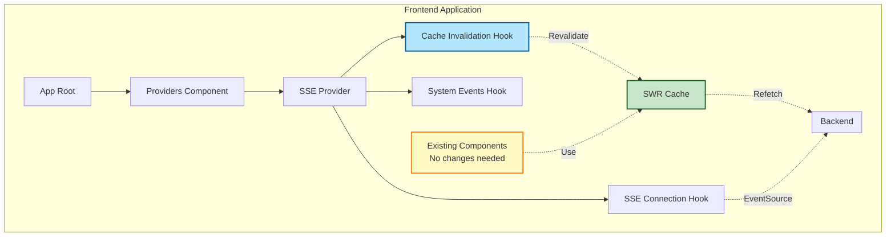
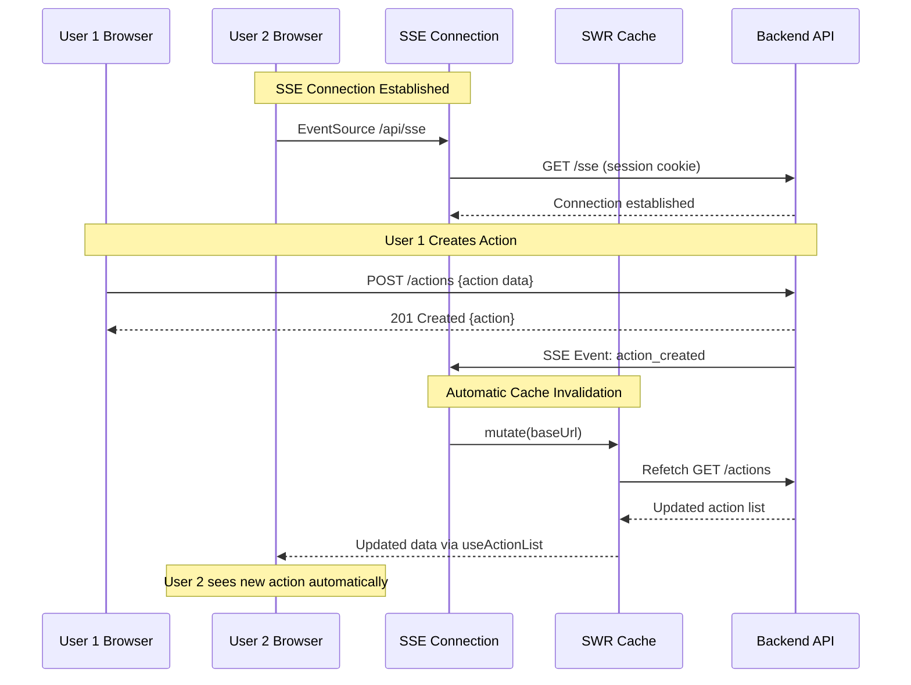

# SSE Communication - Frontend Implementation Plan

## Overview

This document outlines the frontend implementation for Server-Sent Events (SSE) infrastructure to enable real-time, unidirectional communication from backend to frontend. The implementation leverages existing codebase patterns (SWR, Zustand, custom hooks) to provide automatic cache invalidation when SSE events are received.

**Design Philosophy: THE SIMPLEST SOLUTION**

Instead of manually updating component state when SSE events arrive, we **revalidate SWR caches** and let SWR refetch the data automatically. This approach:
- Requires zero changes to existing components
- Leverages existing infrastructure (SWR, EntityApi)
- Maintains consistency with REST API patterns
- Provides automatic optimistic updates
- Follows established codebase conventions

---

## Architecture Overview



### Event Flow Sequence



---

## Core Design Decisions

### 1. SWR Cache Invalidation (Not Manual State Updates)

**Why:** Existing components use SWR hooks (`useActionList`, `useAction`, etc.). Rather than manually updating state, we invalidate the SWR cache when SSE events arrive. SWR automatically refetches the data.

**Benefits:**
- Zero component changes required
- Consistent with existing patterns
- Automatic deduplication and request batching
- Built-in error handling and retry logic
- Works with existing optimistic updates

### 2. Strong Typing Throughout

**Why:** TypeScript provides compile-time safety and IntelliSense support.

**Implementation:**
- Event types match backend exactly (`src/types/sse-events.ts`)
- Discriminated unions for automatic type narrowing
- No custom type helpers needed (uses standard TypeScript patterns)
- Strict null checks

### 3. Use Native EventSource API

**Why:** Browser native API provides all needed functionality without external dependencies.

**Native EventSource provides:**
- Automatic reconnection (~3 seconds default)
- Built-in Last-Event-ID support for resumable streams
- CORS credentials mode via `withCredentials` option
- Standard EventTarget interface for event handling
- No external dependencies to maintain

**Alignment with codebase:**
- Uses native browser APIs (consistent with existing patterns)
- Backend supports GET with cookie authentication (EventSource standard)
- Simpler, more maintainable solution following web standards

### 4. Connection State Management via Zustand

**Why:** Follows existing pattern (auth-store, organization-state-store).

**Implementation:**
- `SseConnectionStore` tracks connection state
- States: Disconnected, Connecting, Connected, Reconnecting, Error
- Error tracking with timestamps and attempt numbers
- DevTools integration

### 5. Single Provider Pattern

**Why:** Follows existing `AuthStoreProvider` pattern exactly.

**Implementation:**
- Single `SseProvider` creates store AND establishes connection
- Store creation happens inside provider (like `AuthStoreProvider`)
- Hooks composed within provider component
- Added to root `Providers` component

### 6. Logout Cleanup Registry Integration

**Why:** Follows existing cleanup pattern for proper connection teardown.

**Implementation:**
- Registers SSE cleanup with `logoutCleanupRegistry`
- Ensures connection closed during logout flow
- Consistent with TipTap and other provider cleanup
- Prevents connection leaks and security issues

---

## File Structure

```
src/
├── types/
│   └── sse-events.ts                     # Event type definitions
│
├── lib/
│   ├── stores/
│   │   └── sse-connection-store.ts       # Connection state management
│   │
│   ├── contexts/
│   │   └── sse-connection-context.tsx    # Store context (prevents circular imports)
│   │
│   ├── hooks/
│   │   ├── use-sse-connection.ts         # Native EventSource connection
│   │   ├── use-sse-event-handler.ts      # Type-safe event handler
│   │   ├── use-sse-cache-invalidation.ts # SWR cache invalidation
│   │   └── use-sse-system-events.ts      # System events (force logout)
│   │
│   └── providers/
│       └── sse-provider.tsx               # SSE provider (store + connection)
│
└── components/
    └── providers.tsx                      # Root providers (updated)
```

---

## Implementation Phases

### Phase 1: Type Definitions (Discriminated Unions)

**File:** `src/types/sse-events.ts`

Create strongly-typed event definitions using discriminated unions that match the backend's Rust serialization format exactly (`#[serde(tag = "type", content = "data")]`).

```typescript
import { Id } from './general';
import { Action } from './action';
import { Agreement } from './agreement';
import { OverarchingGoal } from './overarching-goal';

/**
 * Base SSE event structure matching backend serialization
 */
interface BaseSseEvent<T extends string, D> {
  type: T;
  data: D;
}

// ==================== ACTION EVENTS (session-scoped) ====================

export type ActionCreatedEvent = BaseSseEvent<
  'action_created',
  {
    coaching_session_id: Id;
    action: Action;
  }
>;

export type ActionUpdatedEvent = BaseSseEvent<
  'action_updated',
  {
    coaching_session_id: Id;
    action: Action;
  }
>;

export type ActionDeletedEvent = BaseSseEvent<
  'action_deleted',
  {
    coaching_session_id: Id;
    action_id: Id;
  }
>;

// ==================== AGREEMENT EVENTS (relationship-scoped) ====================

export type AgreementCreatedEvent = BaseSseEvent<
  'agreement_created',
  {
    coaching_relationship_id: Id;
    agreement: Agreement;
  }
>;

export type AgreementUpdatedEvent = BaseSseEvent<
  'agreement_updated',
  {
    coaching_relationship_id: Id;
    agreement: Agreement;
  }
>;

export type AgreementDeletedEvent = BaseSseEvent<
  'agreement_deleted',
  {
    coaching_relationship_id: Id;
    agreement_id: Id;
  }
>;

// ==================== GOAL EVENTS (relationship-scoped) ====================

export type GoalCreatedEvent = BaseSseEvent<
  'goal_created',
  {
    coaching_relationship_id: Id;
    goal: OverarchingGoal;
  }
>;

export type GoalUpdatedEvent = BaseSseEvent<
  'goal_updated',
  {
    coaching_relationship_id: Id;
    goal: OverarchingGoal;
  }
>;

export type GoalDeletedEvent = BaseSseEvent<
  'goal_deleted',
  {
    coaching_relationship_id: Id;
    goal_id: Id;
  }
>;

// ==================== SYSTEM EVENTS ====================

export type ForceLogoutEvent = BaseSseEvent<
  'force_logout',
  {
    reason: string;
  }
>;

/**
 * Discriminated union of all SSE events
 * TypeScript automatically narrows the type based on the 'type' property
 */
export type SseEvent =
  | ActionCreatedEvent
  | ActionUpdatedEvent
  | ActionDeletedEvent
  | AgreementCreatedEvent
  | AgreementUpdatedEvent
  | AgreementDeletedEvent
  | GoalCreatedEvent
  | GoalUpdatedEvent
  | GoalDeletedEvent
  | ForceLogoutEvent;
```

---

### Phase 2: Connection State Store

**File:** `src/lib/stores/sse-connection-store.ts`

```typescript
import { create } from 'zustand';
import { devtools } from 'zustand/middleware';

export enum SseConnectionState {
  Disconnected = "Disconnected",
  Connecting = "Connecting",
  Connected = "Connected",
  Reconnecting = "Reconnecting",
  Error = "Error",
}

interface SseError {
  message: string;
  timestamp: Date;
  attemptNumber: number;
}

interface SseConnectionStateData {
  state: SseConnectionState;
  lastError: SseError | null;
  lastConnectedAt: Date | null;
  lastEventAt: Date | null;
}

interface SseConnectionActions {
  setConnecting: () => void;
  setConnected: () => void;
  setReconnecting: () => void;
  setError: (error: string) => void;
  setDisconnected: () => void;
  recordEvent: () => void;
}

export type SseConnectionStore = SseConnectionStateData & SseConnectionActions;

const defaultState: SseConnectionStateData = {
  state: SseConnectionState.Disconnected,
  lastError: null,
  lastConnectedAt: null,
  lastEventAt: null,
};

export const createSseConnectionStore = () => {
  return create<SseConnectionStore>()(
    devtools(
      (set) => ({
        ...defaultState,

        setConnecting: () => {
          set({ state: SseConnectionState.Connecting });
        },

        setConnected: () => {
          set({
            state: SseConnectionState.Connected,
            lastConnectedAt: new Date(),
            lastError: null,
          });
        },

        setReconnecting: () => {
          set({ state: SseConnectionState.Reconnecting });
        },

        setError: (message: string) => {
          set({
            state: SseConnectionState.Error,
            lastError: {
              message,
              timestamp: new Date(),
              attemptNumber: 0,
            },
          });
        },

        setDisconnected: () => {
          set(defaultState);
        },

        recordEvent: () => {
          set({ lastEventAt: new Date() });
        },
      }),
      { name: 'sse-connection-store' }
    )
  );
};
```

---

### Phase 2.5: SSE Connection Context (Prevent Circular Imports)

**File:** `src/lib/contexts/sse-connection-context.tsx`

Extract the context and hook to prevent circular imports between `sse-provider.tsx` and `use-sse-connection.ts`.

```typescript
"use client";

import { createContext, useContext } from 'react';
import { type StoreApi, useStore } from 'zustand';
import { type SseConnectionStore } from '@/lib/stores/sse-connection-store';
import { useShallow } from 'zustand/shallow';

export const SseConnectionStoreContext = createContext<StoreApi<SseConnectionStore> | null>(null);

export const useSseConnectionStore = <T,>(
  selector: (store: SseConnectionStore) => T
): T => {
  const context = useContext(SseConnectionStoreContext);

  if (!context) {
    throw new Error('useSseConnectionStore must be used within SseProvider');
  }

  return useStore(context, useShallow(selector));
};
```

**Why this is needed:**
- `use-sse-connection.ts` needs `useSseConnectionStore`
- `sse-provider.tsx` needs `useSseConnection`
- Without this extraction, we have a circular dependency
- Follows the same pattern as `AuthStoreProvider` / `useAuthStore`

---

### Phase 3: SSE Connection Hook (Native EventSource)

**File:** `src/lib/hooks/use-sse-connection.ts`

```typescript
"use client";

import { useEffect, useRef } from 'react';
import { siteConfig } from '@/site.config';
import { useSseConnectionStore } from '@/lib/contexts/sse-connection-context';
import { logoutCleanupRegistry } from '@/lib/hooks/logout-cleanup-registry';

export function useSseConnection(isLoggedIn: boolean) {
  const eventSourceRef = useRef<EventSource | null>(null);

  const {
    setConnecting,
    setConnected,
    setReconnecting,
    setError,
    setDisconnected,
    recordEvent,
  } = useSseConnectionStore((store) => ({
    setConnecting: store.setConnecting,
    setConnected: store.setConnected,
    setReconnecting: store.setReconnecting,
    setError: store.setError,
    setDisconnected: store.setDisconnected,
    recordEvent: store.recordEvent,
  }));

  useEffect(() => {
    if (!isLoggedIn) {
      eventSourceRef.current?.close();
      eventSourceRef.current = null;
      setDisconnected();
      return;
    }

    setConnecting();

    const source = new EventSource(`${siteConfig.env.backendServiceURL}/sse`, {
      withCredentials: true,
    });

    source.onopen = () => {
      console.log('[SSE] Connection established');
      setConnected();
    };

    source.onerror = (error) => {
      console.error('[SSE] Connection error:', error);

      // Check readyState to distinguish network errors from HTTP errors
      if (source.readyState === EventSource.CONNECTING) {
        // Browser is attempting reconnection (network error)
        setReconnecting();
        console.log('[SSE] Connection lost, browser attempting reconnection...');
      } else {
        // EventSource.CLOSED - permanent failure (HTTP error like 401, 403, 500)
        setError('Connection failed - check authentication or server status');
        source.close();
      }
    };

    eventSourceRef.current = source;

    const unregisterCleanup = logoutCleanupRegistry.register(() => {
      console.log('[SSE] Cleaning up connection on logout');
      source.close();
    });

    return () => {
      source.close();
      setDisconnected();
      unregisterCleanup();
    };
  }, [isLoggedIn, setConnecting, setConnected, setReconnecting, setError, setDisconnected]);

  return eventSourceRef.current;
}
```

---

### Phase 4: Event Handler Hook

**File:** `src/lib/hooks/use-sse-event-handler.ts`

```typescript
"use client";

import { useEffect, useRef } from 'react';
import type { SseEvent } from '@/types/sse-events';
import { useSseConnectionStore } from '@/lib/contexts/sse-connection-context';
import { transformEntityDates } from '@/types/general';

export function useSseEventHandler<T extends SseEvent['type']>(
  eventSource: EventSource | null,
  eventType: T,
  handler: (event: Extract<SseEvent, { type: T }>) => void
) {
  const handlerRef = useRef(handler);
  const recordEvent = useSseConnectionStore((store) => store.recordEvent);

  useEffect(() => {
    handlerRef.current = handler;
  }, [handler]);

  useEffect(() => {
    if (!eventSource) return;

    const listener = (e: MessageEvent) => {
      try {
        const parsed: SseEvent = JSON.parse(e.data);
        const transformed = transformEntityDates(parsed) as SseEvent;

        if (transformed.type === eventType) {
          recordEvent();
          handlerRef.current(transformed as Extract<SseEvent, { type: T }>);
        }
      } catch (error) {
        console.error(`[SSE] Failed to parse ${eventType} event:`, error, e.data);
      }
    };

    eventSource.addEventListener(eventType, listener);

    return () => {
      eventSource.removeEventListener(eventType, listener);
    };
  }, [eventSource, eventType, recordEvent]);
}
```

---

### Phase 5: SWR Cache Invalidation Hook

**File:** `src/lib/hooks/use-sse-cache-invalidation.ts`

```typescript
"use client";

import { useSWRConfig } from 'swr';
import { siteConfig } from '@/site.config';
import { useSseEventHandler } from './use-sse-event-handler';

export function useSseCacheInvalidation(eventSource: EventSource | null) {
  const { mutate } = useSWRConfig();
  const baseUrl = siteConfig.env.backendServiceURL;

  useSseEventHandler(eventSource, 'action_created', () => {
    mutate((key) => typeof key === 'string' && key.includes(baseUrl));
    console.log('[SSE] Revalidated caches after action_created');
  });

  useSseEventHandler(eventSource, 'action_updated', () => {
    mutate((key) => typeof key === 'string' && key.includes(baseUrl));
    console.log('[SSE] Revalidated caches after action_updated');
  });

  useSseEventHandler(eventSource, 'action_deleted', () => {
    mutate((key) => typeof key === 'string' && key.includes(baseUrl));
    console.log('[SSE] Revalidated caches after action_deleted');
  });

  useSseEventHandler(eventSource, 'agreement_created', () => {
    mutate((key) => typeof key === 'string' && key.includes(baseUrl));
    console.log('[SSE] Revalidated caches after agreement_created');
  });

  useSseEventHandler(eventSource, 'agreement_updated', () => {
    mutate((key) => typeof key === 'string' && key.includes(baseUrl));
    console.log('[SSE] Revalidated caches after agreement_updated');
  });

  useSseEventHandler(eventSource, 'agreement_deleted', () => {
    mutate((key) => typeof key === 'string' && key.includes(baseUrl));
    console.log('[SSE] Revalidated caches after agreement_deleted');
  });

  useSseEventHandler(eventSource, 'goal_created', () => {
    mutate((key) => typeof key === 'string' && key.includes(baseUrl));
    console.log('[SSE] Revalidated caches after goal_created');
  });

  useSseEventHandler(eventSource, 'goal_updated', () => {
    mutate((key) => typeof key === 'string' && key.includes(baseUrl));
    console.log('[SSE] Revalidated caches after goal_updated');
  });

  useSseEventHandler(eventSource, 'goal_deleted', () => {
    mutate((key) => typeof key === 'string' && key.includes(baseUrl));
    console.log('[SSE] Revalidated caches after goal_deleted');
  });
}
```

---

### Phase 6: System Events Hook

**File:** `src/lib/hooks/use-sse-system-events.ts`

```typescript
"use client";

import { useRouter } from 'next/navigation';
import { useAuthStore } from '@/lib/providers/auth-store-provider';
import { useLogoutUser } from '@/lib/hooks/use-logout-user';
import { useSseEventHandler } from './use-sse-event-handler';

export function useSseSystemEvents(eventSource: EventSource | null) {
  const router = useRouter();
  const logout = useLogoutUser();
  const isLoggedIn = useAuthStore((store) => store.isLoggedIn);

  useSseEventHandler(eventSource, 'force_logout', async (event) => {
    console.warn('[SSE] Force logout received:', event.data.reason);

    if (isLoggedIn) {
      await logout();
      router.push(`/login?reason=forced_logout&message=${encodeURIComponent(event.data.reason)}`);
    }
  });
}
```

---

### Phase 7: SSE Provider

**File:** `src/lib/providers/sse-provider.tsx`

```typescript
"use client";

import { type ReactNode, useRef } from 'react';
import { type StoreApi } from 'zustand';
import { type SseConnectionStore, createSseConnectionStore } from '@/lib/stores/sse-connection-store';
import { SseConnectionStoreContext } from '@/lib/contexts/sse-connection-context';
import { useAuthStore } from '@/lib/providers/auth-store-provider';
import { useSseConnection } from '@/lib/hooks/use-sse-connection';
import { useSseCacheInvalidation } from '@/lib/hooks/use-sse-cache-invalidation';
import { useSseSystemEvents } from '@/lib/hooks/use-sse-system-events';

export interface SseProviderProps {
  children: ReactNode;
}

export const SseProvider = ({ children }: SseProviderProps) => {
  const storeRef = useRef<StoreApi<SseConnectionStore>>();

  if (!storeRef.current) {
    storeRef.current = createSseConnectionStore();
  }

  const isLoggedIn = useAuthStore((store) => store.isLoggedIn);
  const eventSource = useSseConnection(isLoggedIn);

  useSseCacheInvalidation(eventSource);
  useSseSystemEvents(eventSource);

  return (
    <SseConnectionStoreContext.Provider value={storeRef.current}>
      {children}
    </SseConnectionStoreContext.Provider>
  );
};
```

**Note on Provider Initialization Order:**
`AuthStoreProvider` returns `null` until `useEffect` hydrates from localStorage, causing two render cycles at root.
However, `SseProvider` only mounts once (during second cycle) when `AuthStoreContext` is already available.
This guarantees `useAuthStore((store) => store.isLoggedIn)` reads hydrated state and SSE connects safely if authenticated.

---

### Phase 8: Integrate into Root Providers

**File:** `src/components/providers.tsx`

```typescript
"use client";

import { ReactNode } from 'react';
import { AuthStoreProvider } from '@/lib/providers/auth-store-provider';
import { OrganizationStateStoreProvider } from '@/lib/providers/organization-state-store-provider';
import { CoachingRelationshipStateStoreProvider } from '@/lib/providers/coaching-relationship-state-store-provider';
import { SessionCleanupProvider } from '@/lib/providers/session-cleanup-provider';
import { SseProvider } from '@/lib/providers/sse-provider';
import { SWRConfig } from 'swr';

interface ProvidersProps {
  children: ReactNode;
}

export function Providers({ children }: ProvidersProps) {
  return (
    <AuthStoreProvider>
      <OrganizationStateStoreProvider>
        <CoachingRelationshipStateStoreProvider>
          <SessionCleanupProvider>
            <SWRConfig
              value={{
                revalidateIfStale: true,
                focusThrottleInterval: 10000,
                provider: () => new Map(),
              }}
            >
              <SseProvider>
                {children}
              </SseProvider>
            </SWRConfig>
          </SessionCleanupProvider>
        </CoachingRelationshipStateStoreProvider>
      </OrganizationStateStoreProvider>
    </AuthStoreProvider>
  );
}
```

---

### Phase 9 (Optional): Connection Status UI

**File:** `src/components/sse-connection-indicator.tsx`

```typescript
"use client";

import { useSseConnectionStore } from '@/lib/contexts/sse-connection-context';
import { SseConnectionState } from '@/lib/stores/sse-connection-store';
import { AlertCircle, Loader2, WifiOff } from 'lucide-react';

export function SseConnectionIndicator() {
  const { state, lastError } = useSseConnectionStore((store) => ({
    state: store.state,
    lastError: store.lastError,
  }));

  if (state === SseConnectionState.Connected) {
    return null;
  }

  const getIcon = () => {
    switch (state) {
      case SseConnectionState.Connecting:
      case SseConnectionState.Reconnecting:
        return <Loader2 className="h-4 w-4 animate-spin" />;
      case SseConnectionState.Error:
        return <AlertCircle className="h-4 w-4" />;
      case SseConnectionState.Disconnected:
        return <WifiOff className="h-4 w-4" />;
      default:
        return null;
    }
  };

  const getMessage = () => {
    switch (state) {
      case SseConnectionState.Connecting:
        return 'Connecting to live updates...';
      case SseConnectionState.Reconnecting:
        return 'Reconnecting to live updates...';
      case SseConnectionState.Error:
        return lastError?.message || 'Connection error';
      case SseConnectionState.Disconnected:
        return 'Disconnected from live updates';
      default:
        return '';
    }
  };

  const getColorClass = () => {
    switch (state) {
      case SseConnectionState.Connecting:
      case SseConnectionState.Reconnecting:
        return 'text-yellow-600 dark:text-yellow-400';
      case SseConnectionState.Error:
        return 'text-red-600 dark:text-red-400';
      case SseConnectionState.Disconnected:
        return 'text-gray-600 dark:text-gray-400';
      default:
        return '';
    }
  };

  return (
    <div className={`flex items-center gap-2 text-sm ${getColorClass()}`}>
      {getIcon()}
      <span>{getMessage()}</span>
    </div>
  );
}
```

---

## Testing Strategy

### Unit Tests

```typescript
// src/lib/hooks/__tests__/use-sse-event-handler.test.ts
import { renderHook } from '@testing-library/react';
import { useSseEventHandler } from '../use-sse-event-handler';

describe('useSseEventHandler', () => {
  it('should handle action_created events with correct typing', () => {
    const mockEventSource = new EventSource('mock-url');
    const mockHandler = jest.fn();

    renderHook(() =>
      useSseEventHandler(mockEventSource, 'action_created', mockHandler)
    );

    const event = new MessageEvent('action_created', {
      data: JSON.stringify({
        type: 'action_created',
        data: {
          coaching_session_id: 'session-123',
          action: { id: 'action-1' }
        }
      })
    });

    mockEventSource.dispatchEvent(event);

    expect(mockHandler).toHaveBeenCalledWith(
      expect.objectContaining({
        type: 'action_created',
        data: expect.objectContaining({
          coaching_session_id: 'session-123'
        })
      })
    );
  });
});
```

### Integration Tests

```typescript
// Integration test: SSE event → cache invalidation → component update
import { render, screen, waitFor } from '@testing-library/react';
import { SseProvider } from '@/lib/providers/sse-provider';
import { CoachingSessionPage } from '@/app/coaching-sessions/[id]/page';

describe('SSE Integration', () => {
  it('should update action list when action_created event received', async () => {
    render(
      <SseProvider>
        <CoachingSessionPage sessionId="session-123" />
      </SseProvider>
    );

    expect(screen.queryByText('Test Action')).not.toBeInTheDocument();

    const event = new MessageEvent('action_created', {
      data: JSON.stringify({
        type: 'action_created',
        data: {
          coaching_session_id: 'session-123',
          action: { id: 'action-1', body: 'Test Action' }
        }
      })
    });

    window.EventSource.prototype.dispatchEvent(event);

    await waitFor(() => {
      expect(screen.getByText('Test Action')).toBeInTheDocument();
    });
  });
});
```

---

## Security Considerations

- SSE endpoint requires valid session cookie (handled by `withCredentials: true`)
- Backend validates session via `AuthenticatedUser` extractor
- Backend determines event recipients (not client-controlled)
- Type guards validate event structure at runtime
- HTTPS enforced in production (via nginx)
- Session cookies are httpOnly and secure

---

## Performance Considerations

- Single connection per user (not per component)
- Minimal bandwidth (only events for this user)
- Keep-alive messages every 15s prevent timeouts
- Native browser reconnection prevents connection leaks
- SWR deduplicates simultaneous cache invalidations
- Broad cache invalidation leverages SWR's batching

---

## Debugging Guide

### Check connection state:
```typescript
import { useSseConnectionStore } from '@/lib/providers/sse-provider';

function DebugComponent() {
  const connectionState = useSseConnectionStore((store) => ({
    state: store.state,
    lastError: store.lastError,
    lastConnectedAt: store.lastConnectedAt,
    lastEventAt: store.lastEventAt,
  }));

  return <pre>{JSON.stringify(connectionState, null, 2)}</pre>;
}
```

### Check Redux DevTools:
1. Open Redux DevTools → `sse-connection-store`
2. View connection state, errors, timestamps
3. Monitor state transitions

---

## Summary

This implementation provides a robust, type-safe, and maintainable SSE solution that:

✅ Uses native browser APIs (no external dependencies)
✅ Follows existing patterns (SWR, Zustand, hooks, providers, logout cleanup)
✅ Requires zero component changes (automatic cache invalidation)
✅ Strongly typed throughout (discriminated unions)
✅ Handles failures gracefully (automatic reconnection)
✅ Integrates seamlessly (with existing auth, routing, caching)
✅ Production-ready (error tracking, debugging, monitoring)

The key insight: **leverage SWR cache invalidation instead of manual state updates**. This is simpler, more reliable, and consistent with existing codebase patterns.
